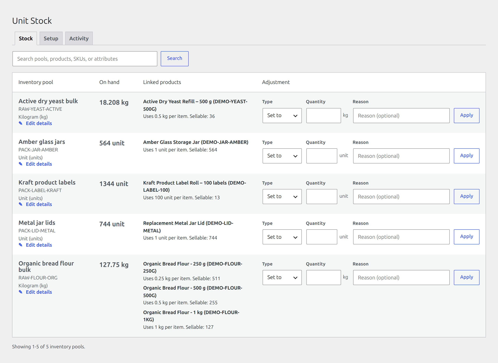

# Laqi Unit Stock Manager for WooCommerce

**One physical stock balance, shared by every package size you sell it in.**

[Install from WordPress.org](https://wordpress.org/plugins/laqi-unit-stock-manager/) ·
[Documentation](https://laqi-logistics.com/documentation/laqi-unit-stock-manager/) ·
[Pro add-on](https://laqi-logistics.com/plugins/laqi-unit-stock-manager/)

Keep 10 kg of an ingredient in one inventory pool, and link the 250 mg, 1 g, 50 g,
500 g and 2 kg packages to it. Enter each package in whatever unit suits it — whole
or decimal — and every sale draws that exact quantity from the shared pool.

Quantities are held as **whole numbers, not floats**, so milligram packages sharing a
balance with kilogram ones never accumulate rounding drift. That is the part most
inventory plugins get wrong, and it is why this one exists.



## This is the free plugin, and it is not a demo

It is the complete, authoritative inventory engine:

- **Inventory pools** measured by mass, volume, length or count, with any number of
  simple products and individual variations linked to each
- **Exact units** — metric, US customary and imperial, kept separate; convert while
  configuring a mapping; define store-specific units like a 25 kg sack or a 24-unit
  tray, and retire them without invalidating history
- **Safe WooCommerce stock handling** — the whole cart is aggregated before a pool is
  checked, so individually valid lines cannot oversell it together. Classic checkout
  and the Store API used by Cart & Checkout Blocks are both validated.
- **Correct reversals** — cancellations, refunds and restocks return the exact original
  quantity, and admin order edits are reconciled. The mapping version and pool demand
  used at purchase are preserved even if the product is reconfigured later.
- **No licence, no account, no SDK.** This package contains no licensing code and
  contacts nobody.

There are no caps here to upgrade past. WordPress.org
[Guideline 5](https://developer.wordpress.org/plugins/wordpress-org/detailed-plugin-guidelines/)
forbids shipping functionality that is present but locked behind payment, so anything
paid has to be genuinely separate code — which is what the add-on below is.

## Laqi Unit Stock Manager Pro

This plugin keeps the numbers right. **Pro is the operations built around them** — a
separate plugin installed alongside it. Both stay active, and this plugin remains the
authoritative ledger; Pro never overrides it.

| | What it adds |
|---|---|
| **Receiving & traceable batches** | Suppliers and purchasing packs, scheduled incoming deliveries, supplier lots, expiry dates and material cost. FEFO allocation or explicit dispatch priority. Hold, quarantine, count, write off, transfer and recall, with an auditable event history — and a review of affected orders and customers before a recall is confirmed. |
| **Planning & purchasing** | Demand forecasting with days remaining, projected stock-out date and confidence. Safety stock, supplier lead time, incoming stock, and whole-pack reorder suggestions saved as immutable purchase-order drafts with separate approval. |
| **Alerts** | Low-stock email and signed-webhook alerts with reminders, escalation, quiet hours and delivery history. Expiry warnings for dated stock. |
| **Recipes & costs** | Multi-component recipes from ingredients, containers, closures and labels. Weighted material cost and unit economics from priced receipts. Typed physical losses for spillage, processing loss, evaporation, damage, samples and expiry. |
| **Daily controls** | Reusable adjustment reasons, capability-based approval policies for sensitive changes, an anomaly review that never touches the free ledger, and a searchable movement ledger with spreadsheet-safe CSV export. |
| **Mobile & integrations** | Mobile stocktaking with SKU/GTIN/UPC/EAN lookup and camera scanning where the browser supports it. Versioned CSV exchange, authenticated atomic stock movements for ERP and WMS, and read-only stock and forecast fields for rule engines. |
| **Compatibility** | Product Bundles, Composite Products and subscription renewals, without double-counting container or copied order lines. |

**[See the full comparison and pricing →](https://laqi-logistics.com/plugins/laqi-unit-stock-manager/)**

Removing Pro later is a one-plugin deactivation. Pools, mappings, movements and stock
levels all stay, because this plugin owns them.

## Development

Clone this repository into any WordPress install's `wp-content/plugins/` and it
runs. Ours is bind-mounted into a Docker stack at
`wp-content/plugins/laqi-unit-stock-manager`, so the running site serves the checkout
directly and Xdebug attaches to it — but nothing here depends on that setup.

```bash
cd /path/to/wordpress_localhost

# Work inside this plugin (deps + lint with THIS plugin's phpcs.xml.dist).
WORK="docker.exe compose exec -u www-data -w /var/www/html/wp-content/plugins/laqi-unit-stock-manager php-fpm"
$WORK composer install     # PSR-4 autoload + dev tools (optional)
$WORK phpcs                # lint to WordPress standards + PHP 7.4 compat
$WORK phpcbf               # auto-fix

# Tests (run `make test-install` once first)
make test p=laqi-unit-stock-manager

# Build assets only if you adopt a wp-scripts build (blocks/React/SCSS).
make npm p=laqi-unit-stock-manager c="install"
make npm p=laqi-unit-stock-manager c="run build"
```

See [Contributor extension recipes](docs/contributor-extension-recipes.md) for
the supported unit, movement, calculator, admin-section, notification, exchange,
order-adapter, and allocation extension patterns.

## Structure

```
laqi-unit-stock-manager.php   # bootstrap: headers, constants, autoload, lifecycle, init
uninstall.php         # data cleanup on delete (plugin NOT loaded here)
src/Plugin.php        # main class (PSR-4 namespace LaqiUnitStockManager); WC guard, HPOS, i18n
src/Privacy.php       # exporter, eraser, and privacy-policy integration points
src/Assets.php        # scopes Unit Stock admin styles
assets/css/           # admin.css (Unit Stock screen only, version-busted)
languages/            # .pot / .po / .mo / .json — see languages/README.md
bin/build.sh          # build the complete WordPress.org Free zip
bin/install-wp-tests.sh # provision pinned WordPress test suites for CI
.github/workflows/    # quality.yml + gated Free release.yml
tests/                # PHPUnit (WordPress test suite)
phpcs.xml.dist        # WordPress standards + PHP 7.4 compatibility
composer.json         # PSR-4 autoload + dev tooling
```

## Releasing

This plugin is its own git repo. To ship a version, publish a **GitHub Release**;
`.github/workflows/release.yml` then builds and attaches
`laqi-unit-stock-manager-<version>-wordpressorg.zip`, the complete Free plugin.
Paid implementations are released separately from `laqi-unit-stock-manager-pro`;
this repository never generates a paid edition or strips Free source into one.

The workflow is **OFF until** you set the repo variable
`RELEASE_BUILDS_ENABLED=true` (`gh variable set RELEASE_BUILDS_ENABLED --body true`).
The merge-gated `quality.yml` workflow runs on pushes to `main`, manual dispatch,
and release workflow calls; it intentionally does not run on pull requests.
Before merging a PR, run the relevant checks locally. The hosted gate covers
coding standards, PHP syntax, PHPUnit across the supported PHP/WordPress matrix,
the WordPress.org archive, and an authenticated Playwright + axe admin-quality
test in a real WordPress/WooCommerce environment.
Complete the manual screen-reader, keyboard, zoom, contrast, and performance
checks in `docs/release-quality-checklist.md` before WordPress.org publication.
Releases call that same workflow and cannot package until it passes.
Build locally with:

```bash
composer install --no-dev --optimize-autoloader
# Only when package-lock.json is committed:
npm ci
npm run build
bash bin/build.sh --channel wordpressorg

# After building the separately distributed Pro WooCommerce archive:
bash bin/verify-edition-archives.sh \
  dist/laqi-unit-stock-manager-<version>-wordpressorg.zip \
  ../laqi-unit-stock-manager-pro/dist/laqi-unit-stock-manager-pro-<version>-woocommerce.zip
```

The archive excludes the complete Composer runtime and uses the fallback PSR-4
loader. If a lockfile marks a real asset build, packaging fails
unless its generated runtime exists.

The edition-boundary verifier checks the exact ZIPs for Pro/SDK residue in Free,
Free namespace implementations in Pro, the declared Pro dependency on Free, and
byte-identical PHP files that would indicate a copied runtime.

## Assets

Styles live in `assets/css` and are enqueued by `src/Assets.php` only on the
Unit Stock workspace and WooCommerce product editor, with a unique handle and
file-mtime cache busting. The workspace is registered under **Products → Unit
Stock**. A simple product's single-pool mapping lives in its **Unit Stock** Product
data panel. Variable-product mappings live inside each native variation panel;
the product-level Unit Stock panel provides only a compact configured-count summary.
They save with WooCommerce's normal product or variation action. Multi-component
recipes remain in their dedicated central workspace. The Setup tab uses
WooCommerce's enhanced selector for scalable AJAX
product, variation, and inventory-pool search. Active links are reviewed in a
compact directory that routes ongoing edits back to the owning product, and can
be soft-unlinked there; historical mapping components remain available
for immutable order restoration. The plugin has no frontend UI and registers no
one screen-scoped plugin script; it registers no storefront assets. The native
Products list bulk-loads a Unit Stock status projection for its current page and
offers linked, unlinked, incomplete/warning, and recipe filters without per-row
mapping queries. Context links lead to the exact variation, relevant pool search,
or Activity view filtered to the mapping's pools.

Mapping edits update the active pool and exact consumption rule without repeating
the one-time native-stock migration decision. They use optimistic mapping versions,
so a stale form cannot silently overwrite a newer administrator change.
Current product links use the shared pagination renderer in 25-row pages, so the
Setup tab can manage every active mapping without a fixed listing ceiling.

The separately distributed Pro add-on supports WooCommerce Product Bundles and
Composite Products through Free's documented demand-inclusion filters. Their
container cart/order lines are excluded from pooled demand, while their normal
quantity-synchronized child lines continue through Free's cart validation,
immutable snapshots, reductions, restorations, and order edits exactly once.

The Pro WooCommerce Subscriptions adapter prepares each renewal as its own stock
event. Because Subscriptions copies line-item metadata forward, inherited pooled
snapshots are replaced once at renewal creation using the mapping active at that
moment. The exact renewal demand is reserved while pending; the normal Woo order
hooks convert it on reduction, release it on failure/cancellation, and restore
the immutable renewal snapshot when stock is restored.

Woo Mobile and other WooCommerce REST clients use the same immutable snapshot,
reservation, reduction, restoration, and order-edit lifecycle as browser orders.
Authorized inventory clients can resolve a scanned product SKU or WooCommerce
GTIN/UPC/EAN/ISBN through `GET /wp-json/laqi-lusm/v1/scan?code=...` and receive
its exact per-sale pool demand, available pool balances, and sellable quantity.

The Pro Mobile count tab turns that lookup into a touch-friendly stocktaking
workflow. Staff may type a code or, where the browser supports Barcode Detector
and camera access, scan it directly; multi-component products expose every
affected pool for an explicit choice. Exact physical counts are submitted to
`POST /wp-json/laqi-lusm/v1/pools/<id>/stocktake` with a required reason and
stable request key. Counts use the shared adjustment service, create an audited
`manual_set` movement sourced as `mobile_stocktake`, and safely reuse retry keys.
The plugin resolves existing WooCommerce codes but does not generate barcodes.

ERP and WMS clients can submit up to 100 relative pool changes as one authenticated
event through `POST /wp-json/laqi-lusm/v1/external-movements`. Pool SKUs must be
unambiguous, quantities are normalized through the registered unit system, the
whole event commits or rolls back together, and stable event IDs make safe retries
return the original movement results. External clients never write balances or
ledger rows directly.

Stock & Pricing Automation and other rule engines can discover read-only field
definitions through `laqi_lusm_read_only_rule_field_catalog` and resolve values
for a product/variation through `laqi_lusm_read_only_rule_field_values`. The
provider exposes mapped state, limiting sellable quantity, minimum valid days of
cover, and an aligned collection of pool balance, filtered availability,
consumption, and forecast data. The contract contains no write callback and does
not expose the stock mutation service.

The separately distributed Pro add-on owns the Anomalies tab and consumes Free's
public movement-history, mapping, and mapping-diagnostics services. It performs
a read-only review without duplicating Free's inventory rules or receiving the
internal container. Pro-owned filters can adjust its large-change threshold or
extend its findings without adding paid implementation code to this repository.

Pro also owns searchable, paginated ledger presentation and spreadsheet-safe CSV
export. It consumes Free's public read-only movement history and presenter while
Free remains the sole owner of immutable ledger storage and stock mutations.

The separately distributed Pro add-on owns reusable adjustment reasons and
sensitive-change approval policies. It attaches through the versioned extension
context and the Free-owned `laqi_lusm_adjustment_authorized` and
`laqi_lusm_adjustment_reason_templates` hooks; no paid implementation ships in
this repository for that capability.

Typed physical-loss workflows likewise live in the separate Pro add-on. Pro
registers stable `loss_*` movement labels, its templated admin section, and its
controller through the extension context while Free remains the only service
that validates and applies the resulting stock change.

Custom units use soft retirement. The repository prevents retirement while a pool
uses the key as its base/display unit or another active custom unit references it;
retired records remain stored so a historical key is never redefined accidentally.

The Stock tab searches pool names and internal SKUs together with linked product
names, variation SKUs, and attributes. Results use repository-backed counts and
25-row pages, so the admin screen does not silently stop at a fixed catalog size.
Pool names, internal SKUs, and compatible display units can be corrected inline
without changing the normalized balance; optimistic versions protect concurrent edits.
The Activity tab uses the same shared pagination renderer to expose the complete
append-only ledger in 50-row pages. The versioned movements REST endpoint accepts
`page` and `limit` and returns matching pagination metadata alongside its items.
All plugin-owned globals use `laqi_lusm_`; registered handles, slugs,
HTML IDs, CSS classes, and CSS custom properties use the equivalent hyphenated
form combining `laqi` with the plugin initials. Do not shorten UI selectors just
because an element appears only on the plugin's own admin screen. Add a file,
then enqueue it through an equally narrow screen or feature guard.

For a real build pipeline (Gutenberg blocks, React, JSX, SCSS), use
`@wordpress/scripts` (`package.json`): source in `assets/src`, output to
`build/`, and enqueue using the generated `build/*.asset.php` (deps + version).

## Privacy and background work

`src/Privacy.php` registers the WordPress exporter, eraser, and suggested
privacy-policy content. Attributed movements export with the acting user and an
erasure request anonymizes that association while retaining the stock ledger.

Premium supply-state modules may reduce on-hand stock to an available-to-sell
quantity through `laqi_lusm_pool_available_quantity`. The filter receives the
current normalized on-hand integer and pool ID; implementations must return a
normalized integer and must not mutate stock. Order reservations, non-sellable
holds, and merchant-defined safety stock compose through this contract, while
the reusable projection service reports current and post-incoming availability.
The Free availability and mutation services remain edition-neutral.

Paid receiving creates one idempotent batch record per supplier-receipt movement,
including the supplier lot, optional expiry, receipt cost snapshot, received and
remaining normalized quantities. The batch repository exposes dated stock in
earliest-expiry-first order with undated receipts last; allocation and recall
modules build on that contract without changing the original pool ledger.
The shared mutation engine exposes `laqi_lusm_stock_movement_applying` from
inside its existing database transaction. Paid FEFO allocation journals each
batch or legacy-unbatched portion there, so a failed extension rolls back the
pool, batch balances, and movement together. Positive order movements restore
the exact consumed lots before a later stock cycle can allocate them again.
Expired active lots remain physically on hand but are excluded from storefront,
reservation, hold, and order-allocation capacity; non-order corrections may
still reduce them so later quarantine and write-off workflows are not blocked.
The Receiving tab also provides exact batch stocktakes, permanent write-offs,
and reversible quarantine/release controls. Quarantined quantities remain in
physical on-hand stock but are excluded from every availability path. Each
status transition records its quantity snapshot, actor, optional reason, and
timestamp in an append-only batch-event journal; quantity-changing operations
continue to use the authoritative stock movement and allocation journals.
The recall review derives affected orders from the immutable allocation journal,
requires explicit merchant confirmation and a reason, quarantines the remaining
lot as recalled, and never contacts customers automatically.
Compatible-pool transfers use one multi-pool mutation transaction: the source
lot decrement, paired transfer movements, destination balance, derived lot, and
source-batch lineage either all commit or all roll back. Lot, expiry, quarantine
state, currency, and proportional receipt cost follow the transferred quantity.
The same Receiving tab owns a site-wide expiry warning window and notification
recipient list. A daily evaluator sends deduplicated near-expiry and expired
alerts for non-empty dated batches. Once a batch has expired, its remaining
quantity can only be removed through the dedicated expiry-waste action, which
records a `loss_expiry` movement and preserves the batch and pool audit trail.

Every Action Scheduler hook added by the plugin must also be added to the list in
`Plugin::on_deactivate()`. Deactivation must cancel all plugin-owned scheduled
work; uninstall must repeat that cleanup and remove plugin-owned data.

## Internationalization

The text domain is the slug `laqi-unit-stock-manager`; `Domain Path` is `/languages`.
Wrap **every** user-facing string — PHP (`__()`, `esc_html__()`) and JS
(`wp.i18n.__()`) — in that domain. Regenerate translation files per
[`languages/README.md`](languages/README.md).
